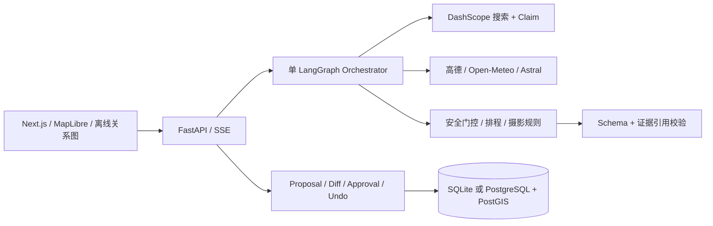

# PhotoScout Agent

**去光发生的地方。** 一个支持真实参考图、组合式摄影意图、机位关系与人工审批的摄影工作台。

> **参考照片寻找原机位**：上传照片，让 Agent 推断具体道路、城墙段或观景点，收集真实网页证据并用地图、距离和方位关系核验。缺少证据的候选仍保留并分级展示。识别阶段不填写日期；确认原机位后可生成所选日期的复刻建议。详见 [使用说明与验收](docs/reverse-photo-planning.md)。

用一句话描述想拍的画面，确认 Agent 识别出的目的地、日期、题材和偏好，再发现值得拍的候选机位。天气和出行偏好通常影响排序与提醒；每个机位展示站位区域、主体、时间、拍法和来源。南京人像与城市夜景保留为快捷模板，所有摄影方向平等参与同一条工作流。

> **自然语言与发现优先升级**：新增可编辑需求确认、高德歧义地点选择与稳定地点记录；移除四种拍摄方式及默认出行硬筛选；雨天、光线不匹配等保留候选并提醒。实现、验收与边界见 [本轮升级说明](docs/discovery-agent-upgrade.md)。

> **2026-09-12 Agent 优先升级**：完整时间、器材和摄影意图进入千问联网任务；千问的回答、候选与引用先保留，再叠加高德、天气、太阳和多主体方向核验。无法定位不再等同于没有结果。详见 [Agent 优先发现与地图增强](docs/agent-first-discovery.md)。

已经实现 **Next.js + FastAPI + 单 LangGraph 工作流**，不是静态页面。提供完全离线的 Seed Demo、DashScope/高德/Open-Meteo 服务端适配器、SQLite/PostgreSQL 持久化、可审查 Proposal/Diff、并发审批与 Undo。

> **2026-09-10 产品升级**：真实高德照片、多源发现适配层、风光/人像/人文/建筑等组合意图、Place/PhotoSpot/Subject 分离已接入。119 项后端测试、8 项浏览器 E2E、62 条离线评测通过；真实图像代理、搜索、天气、机位方向等 14 项 Live 检查通过。Wikimedia 当前网络超时，Flickr 未配置 Key，二者已验证模拟契约与降级。详见 [本次升级说明与阅读指南](docs/product-upgrade.md) 和 [验收原始报告](docs/verification/product-upgrade-live.json)。当前仍是单用户本地工作台，公网商业运营条件见 [已知限制](docs/limitations.md)。

> **2026-09-11 候选发现升级**：新增隔离的 Bilibili 公共元数据适配器与搜索降级；每个机位独立推荐，不安排访问顺序；定位、本地时间与跨天默认值自动填写，器材表单移除默认出行硬筛选。140 项后端测试、12 项页面 E2E（11 项离线 + 1 项保存的真实结果）、63 条离线评测通过；最终 18 项 Live 检查通过。Bilibili 直接访问本机受限，真实验收验证了降级路径。详见 [本轮升级说明](docs/candidate-discovery.md)。

## 30 秒 Demo（依赖已安装）

在项目目录的 PowerShell 中运行：

```powershell
.\start.ps1
```

打开 [PhotoScout 本地页面](http://127.0.0.1:3800)。点击左侧“紫金山的光与影”或“蓝调时刻的南京”，保留“离线演示”，点“发现值得拍的机位”并确认需求。随后查看候选卡“规则依据”，点击“天气变差”生成提案，批准，再撤销。

停止服务：` .\stop.ps1 `。数据保存在本地 `photoscout.db`，停止服务不删除数据。

默认使用 **3800** 端口：本机 Windows 将 2853–3352 等范围保留给系统，原 3000 端口不可用。服务仅绑定回环地址，不对公网开放。

## 首次安装

需要 Python 3.12、Node.js 24、npm；安装过程需联网。现有 `.env` 保留不变，没有密钥也能运行两个离线 Demo。

```powershell
# 同时创建虚拟环境、安装锁定依赖，并启动前后端
.\start.ps1 -Install
```

冷启动时下载依赖的时间取决于网络，不保证 3 分钟完成。安装完成后 Demo 不依赖第三方服务。启动器使用隐藏窗口，运行日志在 `.run/`。

也可以在两个终端中分别运行：

```powershell
# 终端一：项目根目录
py -3.12 -m venv .venv
.venv\Scripts\python -m pip install -r requirements.lock
.venv\Scripts\python -m pip install --no-deps -e .
.venv\Scripts\python -m uvicorn backend.app.main:app --host 127.0.0.1 --port 8000
```

```powershell
# 终端二
cd frontend
npm ci
npm run dev
```

macOS/Linux 用 `python3.12 -m venv .venv` 与 `.venv/bin/python` 替换上面的 Python 路径；前端命令相同。

## 如何用 Live 模式

根目录 `.env` 支持原方案中全部变量：

| 变量 | 用途 |
|---|---|
| `DASHSCOPE_API_KEY` | 百炼密钥，仅后端读取 |
| `DASHSCOPE_NATIVE_BASE_URL` | 原生多模态流式搜索端点根路径 |
| `DASHSCOPE_BASE_URL` | 保留的兼容接口配置，当前搜索使用原生通道 |
| `QWEN_MODEL` | 默认 `qwen3.7-plus` |
| `AMAP_WEB_SERVICE_KEY` | 高德 Web 服务密钥，仅后端使用 |
| `AMAP_BASE_URL` | 默认 `https://restapi.amap.com` |
| `FLICKR_API_KEY` | 可选 Flickr Key，未配置则跳过 |
| `ENABLE_COMMUNITY` | 默认 true，启用少量匿名社区元数据；受限时降级公开搜索 |
| `ENABLE_EXTERNAL_PHOTOS` | 默认 true，控制 Wikimedia/Flickr 图片发现 |
| `DISCOVERY_PHOTO_TIMEOUT` | 每个外部图片 Provider 总预算，默认 8 秒 |
| `DATABASE_URL` | 默认 SQLite；可切 PostgreSQL + psycopg |
| `REDIS_URL` | 可选 Redis；未配置时用有界进程内缓存 |
| `AMAP_MIN_INTERVAL` | 高德请求最小间隔秒数，默认 0.6；处理业务限流时有限重试 |

确认账户端点、余额与可接受费用后，在表单切换“Live · 联网发现”。每次计划最多 2 次搜索、6 个入选地点，搜索输出最多 2000 tokens/次；读接口至多重试一次，收费搜索不自动重试。服务启动不调用付费 API；页面打开后可调用高德定位，但不会自动发起付费搜索。自动测试使用模拟数据。费用以 Provider 账单为准，页面不捏造金额。

Live 地点依赖高德国内覆盖；时间按浏览器本地 IANA 时区提交，结果按该时区显示。有歧义的目的地/POI 会要求补充或跳过，不直接取第一个结果。缺失搜索来源不生成无依据的候选。具体站位无法定位时，可以退回来源所述的所属地点，并标为区域候选；整个发现没有可靠候选才明确失败，不偷偷替换目的地。

天气日期在可用预报范围外，返回未知天气的天文草案。每个机位独立评估天气与光线，不以换点路线或默认步行预算排除候选；不把 POI 中心当入口。开放与临时管控需要官方原文/现场核验；当前不会自动宣布任意景区可进入。

在线底图由用户点击后加载；离线图一直可用，且不伪装成导航地图。高德 GCJ-02 在后端近似转换为 WGS84；用户坐标确认输入为 WGS84。

已完成一次预报范围内的南京人像真实端到端验收；可复用探针与结果检查脚本见 [验收报告](docs/live-acceptance.md)。搜索引用增加地点相关性筛选，仅保留实际采用的来源；相关标题仍不能代替全文和现场核验。

## 验证

```powershell
.venv\Scripts\python -m pytest -q
.venv\Scripts\python -m ruff check backend tests evals scripts
.venv\Scripts\python -m evals.run
.venv\Scripts\python scripts/check_secrets.py
cd frontend
npm run typecheck
npm run build
npx playwright install chromium
# 保持后端及前端运行
npm test
```

`evals/reports/latest.json` 保存每条离线评测与真实耗时。E2E 报告为 `frontend/test-results/report.json`，CI 上传报告。测试不读取真实密钥，接口测试通过 `respx` 模拟。

## Docker Compose

启动 Docker Desktop 后：

```powershell
docker compose up --build
```

同样访问 [本地页面](http://127.0.0.1:3800)。Compose 包含前端、后端、PostgreSQL 17 + PostGIS、Redis；数据库/Redis 不暴露宿主机端口。后端是唯一读 `.env` 的容器，密钥不进入镜像构建上下文。

`docker compose down` 停止容器，数据库卷保留。不要使用 `-v`，除非你明确要删除本地计划。

2026-09-09 已实际执行 `docker compose up -d --build --wait`，数据库/Redis/后端健康，容器版 6 项 E2E 通过，并查询验证 PostGIS 相机/主体几何已入库，SRID 为 4326。

**当前交付预览由 Docker Compose 运行。** 此时无需再运行 `start.ps1`；若要切回本地 SQLite 开发模式，先 `docker compose down`，再 `start.ps1`。两种模式使用独立数据库，原有数据都会保留。

## 架构与目录



领域代码在 `backend/app/`；使用 `start.ps1` 启动本地开发模式后，可打开 [本地 OpenAPI](http://127.0.0.1:8000/docs)。Docker 模式不向宿主机暴露后端端口。前端在 `frontend/`，自动化测试在 `tests/` 与 `frontend/tests/`。设计取舍和限制见 [架构](docs/architecture.md)、[证据与安全](docs/evidence-and-security.md)、[演示脚本](docs/demo-script.md)、[开发记录](docs/progress.md)。

## 本版刻意保留的边界

- 单用户本地应用，无登录和多租户隔离，不能直接作为公开 SaaS 部署。
- 来源验证采用保守策略：社区发现是一等线索，但不能授予开放、安全或商业拍摄许可。
- 实时客流默认 UNKNOWN；没有声称拥有景区实时人数 API。
- 天气恶化默认提议取消受影响的户外段，不杜撰“安全可达”的室内替代点。
- 参数是规则起点，不是现场测光结果；不保证出片。
- 详细说明见 [已知限制](docs/limitations.md)。
