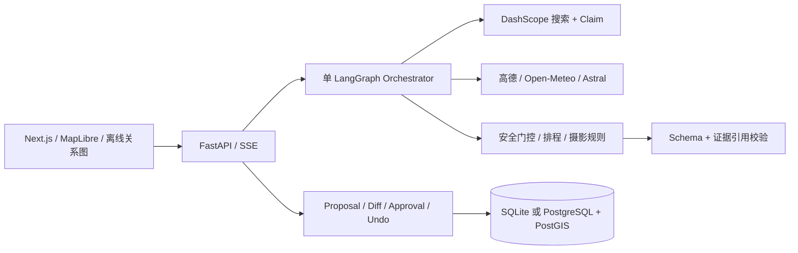

# PhotoScout Agent

**去光发生的地方。** 一个带证据、地图与人工审批的本地摄影规划 MVP。

输入目的地、日期、题材、器材与出行偏好，得到相机站位区域、被摄主体、太阳窗口、参数起点、风险和备选。支持手机打卡、摄影爱好者、内容创作者、家庭轻量旅行四类偏好；南京人像与城市夜景是两个独立演示场景。

已经实现 **Next.js + FastAPI + 单 LangGraph 工作流**，不是静态页面。提供完全离线的 Seed Demo、DashScope/高德/Open-Meteo 服务端适配器、SQLite/PostgreSQL 持久化、可审查 Proposal/Diff、并发审批与 Undo。

> 当前状态：本地 MVP 可用。2026-09-09 实际验证：79 项后端测试、6 项浏览器 E2E、62 条离线评测通过；容器版 PostgreSQL/PostGIS/Redis 集成通过。已使用现有账户完成南京人像 Live 真实搜索、地图、天气、生成、审批、撤销与重启读取，最终 24 项验收检查通过。详见 [Live 验收报告](docs/live-acceptance.md)。Fixture 的 Schema/证据引用完整率 100%，已测试硬门控违反率 0%；这些数字**不代表真实网页准确率或现场安全保证**。见 [评测原始报告](evals/reports/latest.json) 与 [已知限制](docs/limitations.md)。

## 30 秒 Demo（依赖已安装）

在项目目录的 PowerShell 中运行：

```powershell
.\start.ps1
```

打开 [PhotoScout 本地页面](http://127.0.0.1:3800)。点击左侧“紫金山的光与影”或“蓝调时刻的南京”，保留“离线演示”，点“生成我的拍摄计划”并确认需求。随后查看任务卡“规则依据”，点击“天气变差”生成提案，批准，再撤销。

停止服务：` .\stop.ps1 `。数据保存在本地 `photoscout.db`，停止服务不删除数据。

默认使用 **3800** 端口：本机 Windows 将 2853–3352 等范围保留给系统，原 3000 端口不可用。服务仅绑定回环地址，不对公网开放。

## 首次安装

需要 Python 3.12、Node.js 24、npm；安装过程需联网。现有 `.env` 保留不变，没有密钥也能运行两个离线 Demo。

```powershell
# 同时创建虚拟环境、安装锁定依赖，并启动前后端
.\start.ps1 -Install
```

冷启动时下载依赖的时间取决于网络，不保证 3 分钟完成。安装完成后 Demo 不依赖第三方服务。启动器使用隐藏窗口，运行日志在 `.run/`。

也可以在两个终端中分别运行：

```powershell
# 终端一：项目根目录
py -3.12 -m venv .venv
.venv\Scripts\python -m pip install -r requirements.lock
.venv\Scripts\python -m pip install --no-deps -e .
.venv\Scripts\python -m uvicorn backend.app.main:app --host 127.0.0.1 --port 8000
```

```powershell
# 终端二
cd frontend
npm ci
npm run dev
```

macOS/Linux 用 `python3.12 -m venv .venv` 与 `.venv/bin/python` 替换上面的 Python 路径；前端命令相同。

## 如何用 Live 模式

根目录 `.env` 支持原方案中全部变量：

| 变量 | 用途 |
|---|---|
| `DASHSCOPE_API_KEY` | 百炼密钥，仅后端读取 |
| `DASHSCOPE_NATIVE_BASE_URL` | 原生多模态流式搜索端点根路径 |
| `DASHSCOPE_BASE_URL` | 保留的兼容接口配置，当前搜索使用原生通道 |
| `QWEN_MODEL` | 默认 `qwen3.7-plus` |
| `AMAP_WEB_SERVICE_KEY` | 高德 Web 服务密钥，仅后端使用 |
| `AMAP_BASE_URL` | 默认 `https://restapi.amap.com` |
| `DATABASE_URL` | 默认 SQLite；可切 PostgreSQL + psycopg |
| `REDIS_URL` | 可选 Redis；未配置时用有界进程内缓存 |
| `AMAP_MIN_INTERVAL` | 高德请求最小间隔秒数，默认 0.6；处理业务限流时有限重试 |

确认账户端点、余额与可接受费用后，在表单切换“Live · 联网发现”。每次计划最多 2 次搜索、6 个入选地点，搜索输出最多 2000 tokens/次；读接口至多重试一次，收费搜索不自动重试。服务启动和离线测试**不调用付费 API**。费用以 Provider 账单为准，页面不捏造金额。

Live 仅支持高德覆盖的国内地点，时区为 `Asia/Shanghai`。有歧义的目的地/POI 会要求补充或跳过，不直接取第一个结果。缺失搜索来源不生成无依据的候选。无法定位时显示明确失败，不偷偷用南京替换其他城市。

天气日期在可用预报范围外，返回未知天气的天文草案。没有已核验入口间路线时，采用同一区域的拍摄序列；不把 POI 中心当入口。开放与临时管控需要官方原文/现场核验；当前不会自动宣布任意景区可进入。

在线底图由用户点击后加载；离线图一直可用，且不伪装成导航地图。高德 GCJ-02 在后端近似转换为 WGS84；用户坐标确认输入为 WGS84。

已完成一次预报范围内的南京人像真实端到端验收；可复用探针与结果检查脚本见 [验收报告](docs/live-acceptance.md)。搜索引用增加地点相关性筛选，仅保留实际采用的来源；相关标题仍不能代替全文和现场核验。

## 验证

```powershell
.venv\Scripts\python -m pytest -q
.venv\Scripts\python -m ruff check backend tests evals scripts
.venv\Scripts\python -m evals.run
.venv\Scripts\python scripts/check_secrets.py
cd frontend
npm run typecheck
npm run build
npx playwright install chromium
# 保持后端及前端运行
npm test
```

`evals/reports/latest.json` 保存每条离线评测与真实耗时。E2E 报告为 `frontend/test-results/report.json`，CI 上传报告。测试不读取真实密钥，接口测试通过 `respx` 模拟。

## Docker Compose

启动 Docker Desktop 后：

```powershell
docker compose up --build
```

同样访问 [本地页面](http://127.0.0.1:3800)。Compose 包含前端、后端、PostgreSQL 17 + PostGIS、Redis；数据库/Redis 不暴露宿主机端口。后端是唯一读 `.env` 的容器，密钥不进入镜像构建上下文。

`docker compose down` 停止容器，数据库卷保留。不要使用 `-v`，除非你明确要删除本地计划。

2026-09-09 已实际执行 `docker compose up -d --build --wait`，数据库/Redis/后端健康，容器版 6 项 E2E 通过，并查询验证 PostGIS 相机/主体几何已入库，SRID 为 4326。

**当前交付预览由 Docker Compose 运行。** 此时无需再运行 `start.ps1`；若要切回本地 SQLite 开发模式，先 `docker compose down`，再 `start.ps1`。两种模式使用独立数据库，原有数据都会保留。

## 架构与目录



领域代码在 `backend/app/`；使用 `start.ps1` 启动本地开发模式后，可打开 [本地 OpenAPI](http://127.0.0.1:8000/docs)。Docker 模式不向宿主机暴露后端端口。前端在 `frontend/`，自动化测试在 `tests/` 与 `frontend/tests/`。设计取舍和限制见 [架构](docs/architecture.md)、[证据与安全](docs/evidence-and-security.md)、[演示脚本](docs/demo-script.md)、[开发记录](docs/progress.md)。

## 本版刻意保留的边界

- 单用户本地应用，无登录和多租户隔离，不能直接作为公开 SaaS 部署。
- 来源验证采用保守策略：社区发现是一等线索，但不能授予开放、安全或商业拍摄许可。
- 实时客流默认 UNKNOWN；没有声称拥有景区实时人数 API。
- 天气恶化默认提议取消受影响的户外段，不杜撰“安全可达”的室内替代点。
- 参数是规则起点，不是现场测光结果；不保证出片。
- 详细说明见 [已知限制](docs/limitations.md)。
