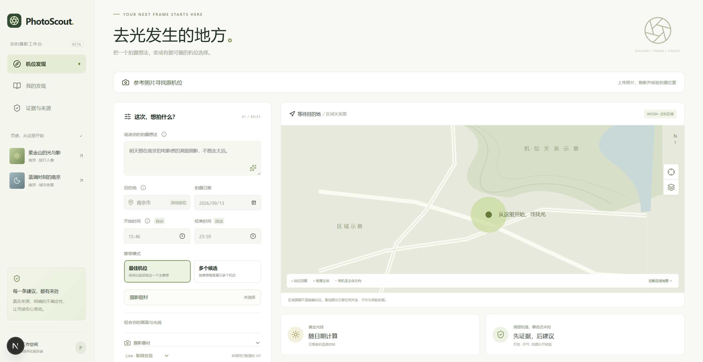
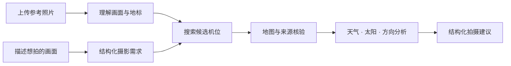
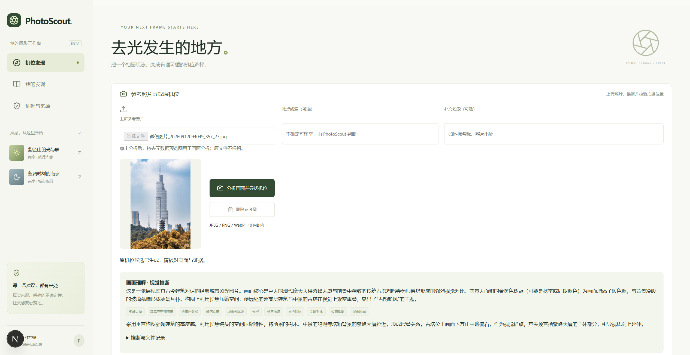
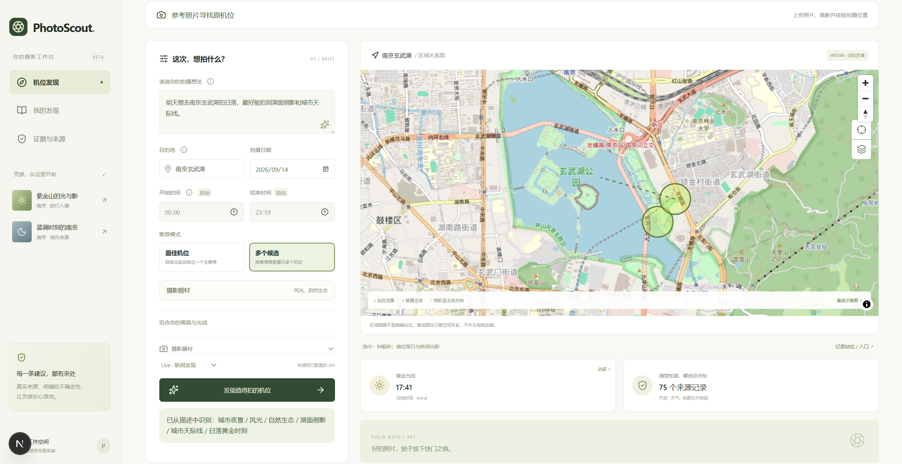
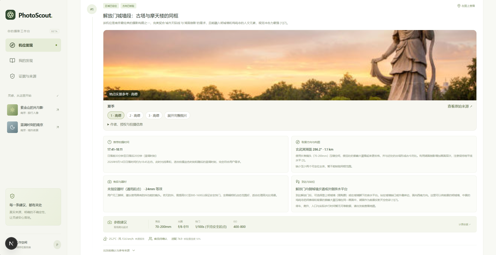
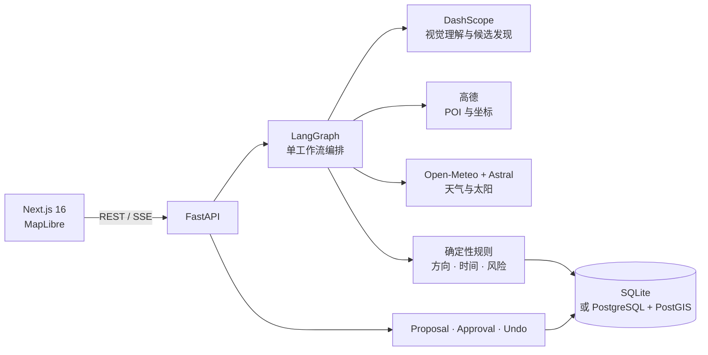

<div align="center">
  
  <h1>PhotoScout</h1>
  <p><strong>去光发生的地方。</strong></p>
  <p>把一张参考照片或一句拍摄想法，变成有坐标、有光线判断、有证据来源的机位建议。</p>

  <p>
    
    
    
    
    
    
  </p>

  <p>
    <a href="#核心能力">核心能力</a> ·
    <a href="#quick-start">Quick Start</a> ·
    <a href="#系统架构">系统架构</a> ·
    <a href="#文档">文档</a>
  </p>
</div>



## PhotoScout 是什么

PhotoScout 是一个本地优先的 AI 摄影机位工作台。它不只回答“去哪拍”，还会把候选机位、被摄主体、地图坐标、天气、太阳位置、拍摄方向和来源证据组织成一份可核验、可执行的拍摄建议。



## 核心能力

| 能力 | PhotoScout 会做什么 |
|---|---|
| **参考照片定位** | 从画面中的建筑、山体、道路和构图关系推断原机位，保留多个候选及各自依据。 |
| **自然语言找机位** | 理解目的地、题材、主体、时间、光线、器材和偏好，把一句想法整理成可确认的摄影需求。 |
| **地图与坐标核验** | 使用高德 POI 定位机位与主体，转换并标注坐标系，区分地图点、区域候选和推测位置。 |
| **环境与方向分析** | 结合 Open-Meteo、Astral 和地标方位，计算天气、日出日落、黄金时刻及取景方向。 |
| **结构化拍摄建议** | 输出站位、时段、焦段、参数、构图、到达提示、风险和来源，而不是一段不可操作的模型长文。 |

## 两种方式，找到下一张照片

<table>
  <tr>
    <td width="50%" valign="top">
      
      <h3>从参考照片出发</h3>
      <p>上传 JPEG、PNG 或 WebP。PhotoScout 分析画面与构图，结合地点线索、网页来源和地图结果生成原机位候选；候选中的不确定性会被明确标注。</p>
    </td>
    <td width="50%" valign="top">
      
      <h3>从拍摄想法出发</h3>
      <p>描述想拍的地点、画面、日期或器材。PhotoScout 将需求结构化，在地图上呈现机位、主体和方向关系，并按证据与拍摄条件组织候选。</p>
    </td>
  </tr>
</table>

## 从“地点”到“怎么拍”

每个候选机位都有独立的拍摄卡片：参考画面、推荐时段、取景方向、焦段与器材、站位说明、参数起点、天气条件、证据来源和待核实风险集中在同一处。



> PhotoScout 提供的是有依据的拍摄决策起点，不是自动导航或现场安全保证。POI 中心、推测坐标与精确相机站位会被区别标注。

## Quick Start

### Windows

需要 Python 3.12、Node.js 24 和 npm。首次运行会创建虚拟环境并安装锁定依赖：

```powershell
git clone https://github.com/sheep1116/PhotoScout-Agent.git
cd PhotoScout-Agent
./start.ps1 -Install
```

随后打开 [http://127.0.0.1:3800](http://127.0.0.1:3800)。以后启动只需：

```powershell
./start.ps1
```

停止服务：

```powershell
./stop.ps1
```

默认数据保存在本地 `photoscout.db`。没有 API Key 也可以使用内置 Seed Demo。

### macOS / Linux

```bash
python3.12 -m venv .venv
source .venv/bin/activate
python -m pip install -r requirements.lock
python -m pip install --no-deps -e .
python -m uvicorn backend.app.main:app --host 127.0.0.1 --port 8000
```

在另一个终端启动前端：

```bash
cd frontend
npm ci
npm run dev
```

### 启用 Live 模式

复制配置模板并填写服务端密钥：

```powershell
Copy-Item .env.example .env
```

最小 Live 配置：

```dotenv
DASHSCOPE_API_KEY=your_key
AMAP_WEB_SERVICE_KEY=your_key
```

DashScope 用于多模态理解和联网候选发现，高德用于地点与坐标，Open-Meteo 与 Astral 提供天气和太阳条件。Flickr、Redis、PostgreSQL/PostGIS 均为可选能力；完整变量见 [.env.example](.env.example)。密钥只由后端读取。

## Docker Compose

```bash
docker compose up --build
```

访问 [http://127.0.0.1:3800](http://127.0.0.1:3800)。Compose 会启动：

- Next.js 前端
- FastAPI 后端
- PostgreSQL 17 + PostGIS
- Redis

```bash
docker compose down
```

数据库卷默认保留。只有明确要删除本地数据时才使用 `docker compose down -v`。

## 系统架构



工作流将生成式能力与确定性核验分开：模型负责理解画面和提出候选，地图、坐标、太阳、天气、Schema 与证据规则负责验证和组织结果。计划修改通过 Proposal / Diff / Approval / Undo 流程持久化。

### 技术栈

| 层级 | 技术 |
|---|---|
| Web | Next.js 16、React 19、TypeScript、MapLibre GL |
| API | FastAPI、Pydantic、SSE |
| Agent | LangGraph、DashScope / Qwen |
| 地理与环境 | 高德 Web Service、Open-Meteo、Astral |
| 数据 | SQLite、SQLAlchemy；可选 PostgreSQL/PostGIS 与 Redis |
| 质量 | Pytest、Ruff、Playwright、离线 Evals |

### 目录

```text
backend/app/       FastAPI、工作流、Provider 与领域模型
frontend/          Next.js 产品界面
tests/             后端与契约测试
evals/             离线评测
docs/              架构、能力边界与验收资料
infra/             容器与 PostGIS 初始化
```

本地开发模式可访问 [FastAPI OpenAPI](http://127.0.0.1:8000/docs)。更完整的工作流、数据模型和 API 说明见 [架构文档](docs/architecture.md)。

<details>
<summary><strong>开发与验证命令</strong></summary>

```powershell
.venv/Scripts/python -m pytest -q
.venv/Scripts/python -m ruff check backend tests evals scripts
.venv/Scripts/python -m evals.run
.venv/Scripts/python scripts/check_secrets.py
cd frontend
npm run typecheck
npm run build
npx playwright install chromium
npm test
```

自动测试使用模拟 Provider，不读取真实密钥。Live 验收边界和原始结果单独保存在 `docs/verification/`。

</details>

## 文档

| 文档 | 内容 |
|---|---|
| [参考照片寻找原机位](docs/reverse-photo-planning.md) | 参考图流程、候选分级、地图核验与使用边界 |
| [Agent-first 发现流程](docs/agent-first-discovery.md) | 结构化候选、来源和地图关系设计 |
| [架构与实现取舍](docs/architecture.md) | 工作流、数据模型、存储、并发与 API |
| [证据与安全](docs/evidence-and-security.md) | 来源等级、Prompt Injection 边界和密钥处理 |
| [已知限制](docs/limitations.md) | 当前产品边界与生产化缺口 |
| [演示脚本](docs/demo-script.md) | Seed Demo 与产品演示路径 |
| [Changelog](CHANGELOG.md) | 版本能力、历史验收和测试记录 |

## 当前边界

PhotoScout 当前定位为单用户、本地优先的摄影工作台，不应直接作为无认证的公网 SaaS 部署。地图点不等于精确站位，开放、票务、临时管控和现场安全需要再次核实；评分与参数是可解释的建议起点，不保证出片。

第三方服务与素材使用需遵守各自条款，参见 [THIRD_PARTY_NOTICES.md](THIRD_PARTY_NOTICES.md)。完整边界见 [docs/limitations.md](docs/limitations.md)。
