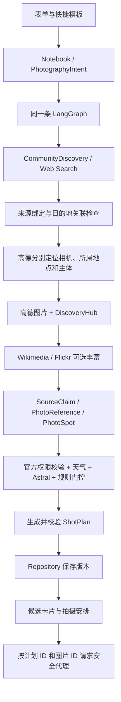

# PhotoScout 0.2 产品升级说明与阅读指南

更新日期：2026-09-10。面向第一次接触这个项目的使用者和开发者。

这次升级让 PhotoScout 从“根据两个示例生成文字计划”，走向“可以看真实图片、组合拍摄需求、追溯发现过程的摄影工作台”。四项功能已经接入现有应用，使用同一条 Agent 工作流。它目前适合本地个人使用与受控测试；不是已经上线的多用户商业服务。

## 1. 先理解它现在能帮你做什么

你可以说：“我想去南京玄武湖，拍风光和建筑，偏好倒影，带 35mm 镜头，下午有五小时，不想走太远。”

PhotoScout 会先确认日期、时间、器材和限制，然后寻找有来源的拍摄地点；把地点和地图中的地标匹配；读取真实图片；检查天气和太阳位置；最后形成可保存、可修改的拍摄计划。

本次真实验收得到的例子是：

| 概念 | 真实结果 | 应怎样理解 |
|---|---|---|
| 所属地点 Place | 玄武湖 | 目的地背景，并不是让你站在湖的中心 |
| 机位 PhotoSpot | 荷花栈道 | 高德能够独立匹配的地标，具体可站位置仍需现场确认 |
| 被摄主体 Subject | 紫峰大厦 | 单独通过高德定位的建筑 |
| 拍摄方向 | 约 271°，接近正西 | 相机地标坐标到主体坐标的几何方向，不是视线无遮挡保证 |
| 参考图片 | 高德返回的实景照片 | 可以帮助判断环境；不保证与本次日期、季节、朝向完全一致 |

“地图定位成功”和“现场可以进入、可以站立、可以架脚架”是不同事情。PhotoScout 不会因为找到图片或坐标就自动把开放状态改成已确认。

## 2. 如何体验这次升级

在项目根目录运行 `./start.ps1`，打开 <http://127.0.0.1:3800>。

1. 在“摄影方向”中选择风光、人像、人文、建筑、自然生态或城市夜景。允许多选，第一项作为主要题材；评分会融合所有已选类别的权重。
2. 展开“组合你的画面与出行条件”。输入拍摄主体与画面风格，以中文或英文逗号分隔；选择日间、日出、黄金时刻、蓝调或夜间，以及客流、通行要求。
3. 在“器材与出行偏好”设置镜头、画幅、脚架、步行上限及是否接受门票；确认当天起止时间。
4. 选择“Live · 联网发现”才会使用真实 API。离线演示完全不调用外部服务，也不会拿生成图片冒充真实参考图。
5. 生成后，先看“拍摄安排”；再切换“候选机位”，浏览未被排进最终行程的候选地点。
6. 在图片下方选择第 1、2、3 张参考图。“展开完整图片”可查看完整画幅，避免封面裁切影响构图判断。
7. 展开“作者、授权与拍摄信息”，查看作者、来源页、获取时间，以及接口实际提供的拍摄日期、GPS、EXIF。缺失字段直接显示未提供。
8. “证据与来源”解释每条数据从哪里来；“出行备忘”会说明哪些服务缺少配置、超时或没有结果。

左侧“紫金山的光与影”和“蓝调时刻的南京”仍然是快捷模板。它们只是填写不同需求，并没有各自维护一套 Agent 流程。

历史计划通过“我的计划”打开。旧版本中没有图片或摄影意图字段的计划仍然可以读取。

## 3. 这次新增了哪些数据概念

### PhotographyIntent：把一句愿望变成结构化需求

“结构化”就是把一大段文字拆成明确的字段，让程序不用反复猜测。

```json
{
  "categories": ["landscape", "architecture"],
  "subjects": ["紫峰大厦", "城墙"],
  "styles": ["倒影", "极简"],
  "light": "daylight",
  "mobility": "standard",
  "equipment": {
    "sensor": "full_frame",
    "tripod": false,
    "lenses": [{"name": "35mm F1.8", "min_mm": 35, "max_mm": 35, "max_aperture": 1.8}]
  },
  "constraints": {
    "max_walk_km": 3,
    "accept_tickets": false,
    "crowd_tolerance": "low",
    "start_local": "14:00:00",
    "end_local": "19:00:00"
  }
}
```

类别、主体和风格影响发现查询；光线偏好影响排程；镜头和画幅约束参数；时间、天气、门票、步行及通行要求参与门控。风格标签是发现与构图偏好，不是可以客观保证的成片风格。

为了兼容旧前端与已有计划，`TripBrief` 仍保留顶层器材、时间和限制字段。Notebook 会把它们统一写入 PhotographyIntent。新调用者可以只在 intent 的 equipment/constraints 中填写；同时提供两处时，显式的顶层字段优先，避免旧表单修改被历史快照覆盖。

“少人”只是一项偏好，当前没有游客实时客流 API，因此不会给出虚假的少人保证。“必须无台阶”是硬要求：缺少可达证据的地点不会进入该行程，可能得到空计划和具体原因。

### Place 与 PhotoSpot：景点不再等于相机位置

`PlaceEntity` 表示所属景区或地点；`PhotoSpot` 表示某个摄影站位候选，包含相机位置、主体、构图、来源及图片。两者可以有不同的高德 ID 和坐标。

搜索输出分开保存：展示名称 `name`、地图查询地标 `camera_poi`、所属地点 `place_name`、站位线索 `camera_instruction`、主体地标 `subject_poi`。例如“某桥旁湖岸”是展示名称，“某桥”才适合拿去地图查询。

地图匹配采用唯一精确名称、有限名称规范化和唯一的“景区-子地标”后缀匹配，不直接取返回列表的第一项。找不到站位时，可以退回已能定位的所属地点，但明确标记 `area_candidate`，不会伪装成精确机位。

独立地标关系匹配成功标记 `mapped_viewpoint`。这一标记仅说明地图关系，不代表实测、安全、可通行。相机和主体坐标独立存在时，才通过确定性计算得到方位角；否则方向为空。

### SourceClaim 与 PhotoReference：文字线索和真实图片各有来处

`SourceClaim` 是“某来源提出的一条说法”，例如构图经验。它记录来源 ID、主体 ID、证据 ID 和可信标签。新增 `photo` 类型，用来关联真实图片记录。

`PhotoReference` 是“图片接口实际返回的一张参考图”。它包含图片地址、原始来源页、来源平台、标题、作者、授权说明、获取时间、可选的拍摄时间/GPS/EXIF，以及证据引用。

图片的关联分为：

- `poi`：高德把这张图关联到该 POI。它仍不等于你本次精确站位、方向的样片。
- `nearby`：Wikimedia/Flickr 在附近检索到的图片。页面明确显示“附近参考 · 非精确站位样片”。GPS 不直接转成用户应站的位置。

## 4. 多源发现是怎样工作的

“Provider”可以理解为适配器：每家网站返回的格式不同，适配器把它翻译成 PhotoScout 能理解的统一格式。

| 来源 | 本次接入方式 | 输出及用途 | 当前真实验证情况 |
|---|---|---|---|
| 高德 | Web Service POI，`extensions=all` | 地标验证、位置、POI 实景照片 | 已通过真实调用与图片代理验证 |
| Web Search / 百炼 | 原生联网搜索，使用搜索返回的真实引用 | 机位名称、站位与主体线索、构图经验 | 已通过真实调用 |
| Wikimedia Commons | 官方 MediaWiki API：附近文件检索＋imageinfo | 附近图片、作者、许可证、可用地理信息 | 适配器与模拟契约通过；当前机器连接超时，真实结果未验收 |
| Flickr | 官方 photos.search，首张候选尝试 getExif | 附近公开图片、GPS、拍摄时间、允许返回的 EXIF | 适配器与模拟契约通过；当前未配置 Key，未真实验收 |
| 小红书、抖音、Bilibili、微博 | 搜索引擎可公开索引的页面 | 发现与摄影经验；保留原页链接和平台标签 | 是否命中取决于公开索引，不承诺每次都有所有平台 |

没有接入这些社区平台的登录态抓取、私有接口或绕过限制的爬虫。搜索引用并不等于已逐句核实全文；发布时间未知就保持未知，不能当作“近期现场实况”。

当前外部图片搜索以已验证地图候选为中心，半径 500 米；每个平台最多丰富前三个候选，每处最多三张。高德每个候选最多四张，优先排列。图片提供者共用接口，未来可增加具有合法授权的社区图片适配器。

最终候选优先考虑已匹配的地标机位，再考虑是否有真实参考图片。天气、危险和开放校验依然独立执行；图片丰富不会覆盖这些限制。

## 5. 后端到前端的完整路径



主工作流仍是 `parse → discover → verify → conditions → schedule → validate`。没有按题材复制流程，也没有新增独立数据库服务。

### 主要修改文件及其作用

| 文件 | 初学者可以怎样理解 |
|---|---|
| `backend/app/models.py` | 数据合同；规定一份需求、机位、图片、计划必须长什么样，并检查证据完整性 |
| `backend/app/discovery.py` | 新的发现与图片适配层；社区平台识别、真实图片归一化、Wikimedia/Flickr、降级与扩展接口 |
| `backend/app/providers.py` | 百炼、高德、天气的网络调用；把搜索地标分别映射为 Place、PhotoSpot、Subject |
| `backend/app/media.py` | 图片传输守门员；只允许受信图片 CDN 和安全图像格式 |
| `backend/app/engine.py` | 不依赖模型猜数值的规则：时间、太阳、参数、评分、硬限制 |
| `backend/app/graph.py` | 把上述步骤串起来，输出进度和运行指标 |
| `backend/app/main.py` | FastAPI 接口入口；新增按计划和图片 ID 读取实景图的接口 |
| `backend/app/config.py` | 服务端设置；新增 Flickr 可选 Key 和外部图片发现开关 |
| `frontend/components/IntentBuilder.tsx` | 组合式摄影意图表单 |
| `frontend/components/PhotoGallery.tsx` | 图片封面、切换、完整画幅、署名、来源和失败状态 |
| `frontend/app/page.tsx` | 工作台页面；新增候选机位列表并接入新组件 |
| `frontend/lib/types.ts` | 前端的数据类型，与后端合同对应 |
| `frontend/app/globals.css` | 新表单、图集和移动端候选卡片样式 |
| `tests/test_product_upgrade.py` | 本次核心回归：安全、图片、意图、地标、范围与历史兼容 |
| `frontend/tests/flows.spec.ts` | 真实浏览器操作测试；包含组合输入、图片切换、失败降级与移动端 |
| `scripts/product_acceptance.py` | 显式执行或复查 Live 验收，保存脱敏报告 |

阅读建议：先看本说明和模型字段，再读 `IntentBuilder`，随后顺着 `graph.py` 看 Providers 与 DiscoveryHub，最后看安全和测试。无需一开始就理解 LangGraph 的全部实现。

## 6. 图片安全、缺失与版权信息

前端请求的是 `GET /v1/plans/{plan_id}/photos/{photo_id}`。服务端先从已保存计划中找图片记录；用户不能传一个任意 URL 让服务器代为下载。

目前仅放行已接入图片 CDN：`store.is.autonavi.com`、`aos-cdn-image.amap.com`、实测发现的 `aos-comment.amap.com`、`upload.wikimedia.org`、`live.staticflickr.com` 和受限的 `farm数字.staticflickr.com`。

代理要求 HTTPS、禁止凭据和非标准端口、拒绝敏感查询参数，检查 DNS 地址不能指向内网，不跟随重定向。文件最多 5 MiB，校验 JPEG/PNG/WebP 文件签名与响应 MIME；拒绝 SVG、HTML 和伪装文件。最多四个并发传输，队列和请求均有时间上限。浏览器只短时私有缓存，不批量归档图片。

无图、失效、网络错误或被拒绝的图片显示明确占位，不会中断计划。没有任何代码让 LLM 生成图片 URL；模型的额外图片字段会被拒绝。

高德未提供作者或授权时，显示“未提供”和默认版权提示，不声称免费可转载。Wikimedia 展示 API 中的作者和许可证；Flickr 当前查询 CC BY 2.0 / CC BY-SA 2.0 图片并保留摄影师页面链接。使用参考图不等于取得任意再分发权，发布时仍应遵守来源授权与平台条款。

## 7. 配置与运行边界

原有 `.env` 不需要重填，高德图片直接复用现有高德 Web Service Key。新增可选设置已写入 `.env.example`，本次没有修改真实 `.env`。

| 设置 | 默认值 | 说明 |
|---|---|---|
| `FLICKR_API_KEY` | 空 | 空值会跳过 Flickr，其他功能正常 |
| `ENABLE_EXTERNAL_PHOTOS` | `true` | 控制 Wikimedia/Flickr 丰富，不关闭高德 POI 图片 |
| `DISCOVERY_PHOTO_TIMEOUT` | `8` 秒 | 每个外部图片平台整份计划的预算，超时保留已有结果 |

付费搜索仍最多两次，每次最多 2000 输出 tokens；没有后台无限搜索或收费重试。真实消耗以账户账单为准，页面不虚构费用金额。

若要新增 Provider：实现 `PhotoProvider.discover()`，通过 `reference()` 归一化图片并创建证据，在 `DiscoveryHub.providers` 注册；若使用新图片 CDN，应先验证实际 API 返回和授权，再添加严格白名单及安全测试。不要直接把模型输出或社区 HTML 中随意找到的 URL 塞给前端。

## 8. 本次验收结果

最终验证结果以 [机器可读 Live 报告](verification/product-upgrade-live.json) 与 [保存的真实计划](verification/product-upgrade-plan.json) 为准。

- 后端：119 项测试通过，含原有回归。
- 生产构建、TypeScript、Ruff 和密钥泄漏检查通过；后端重启后已保存 Live 计划与 6 张图片仍能读取。汇总见 [最终 QA 记录](verification/product-upgrade-qa.json)。
- 离线评测：62/62 通过；它只检查结构、规则和引用完整性，不测量真实网页正确率。
- 浏览器：8 项 E2E 通过，含组合意图和图片失败降级；390px 移动端没有横向溢出。
- Live：14/14 检查通过。验证真实搜索、高德位置、图片代理、天气、太阳、独立机位/主体、来源绑定和缺图 404。
- 实际案例：2 个候选、1 个独立地标机位、3 个拍摄任务、6 张实景图；6 张图片代理均返回 JPEG 200。
- 该次生成耗时约 31 秒，2 次联网搜索，报告 tokens 为 5590。费用金额未估算。
- Wikimedia 当前网络连接超时；Flickr 未配置 Key。它们的真实联网能力没有计入已通过结论，模拟契约和降级路径已覆盖。

验收过程发现并修复了描述性机位名无法定位、景区子地标匹配、同城地点偏离指定景区、来源标题只含景区名被误拒等问题。没有通过放宽为“取第一个 POI”来掩盖问题。

常用复查命令：

```powershell
.venv/Scripts/python -m pytest -q
.venv/Scripts/python -m evals.run
.venv/Scripts/python -m ruff check backend tests evals scripts
.venv/Scripts/python scripts/check_secrets.py
cd frontend
npm run typecheck
npm run build
npm test
```

只复查已有 Live 计划，不重新调用付费搜索：

```powershell
.venv/Scripts/python -m scripts.product_acceptance --plan-id 42fe99cb904b4932acbd1f605b825139
```

显式创建新计划并调用真实 API：`python -m scripts.product_acceptance --create`。运行前确保本地服务已启动。

## 9. 距离公开商业运营还差什么

本次交付的是产品功能升级及本地验收，不包含公网部署。原有 SQLite/PostgreSQL 的 JSON 快照兼容新增字段，无需清空旧数据。

当前仍是单用户工作台；API 没有账户认证和租户隔离，生成任务在单进程内存中。开放测试可放在已有身份验证网关后；面向陌生用户公开运营前，需要补齐用户隔离、每用户配额与成本限制、任务队列恢复、备份迁移、监控和删除机制，以及相应商业数据服务授权。

机位坐标没有实测，社区经验未逐句核实，图片可能过季，实景遮挡和预约政策仍需出发前确认。未知入口不会自动拼接跨地点导航；实时客流和可达证据缺失时，系统保持未知或拒绝满足不了的硬要求。

这几个边界会继续显示在产品中，而不是藏在一份验收通过的报告后面。

## 10. 实现参考的官方文档

- [高德 POI 搜索及扩展图片字段](https://developer.amap.com/api/webservice/guide/api-advanced/search)
- [MediaWiki Imageinfo](https://www.mediawiki.org/wiki/API:Imageinfo/en)、[Geosearch](https://www.mediawiki.org/wiki/API:Geosearch)
- [Flickr photos.search](https://www.flickr.com/services/api/flickr.photos.search.htm)、[photos.getExif](https://www.flickr.com/services/api/flickr.photos.getExif.html)
- [Flickr API 使用条件](https://www.flickr.com/help/terms/api)

这些文档用于理解官方字段和接入方式；本次真实调用结果以本项目验收文件为准。
